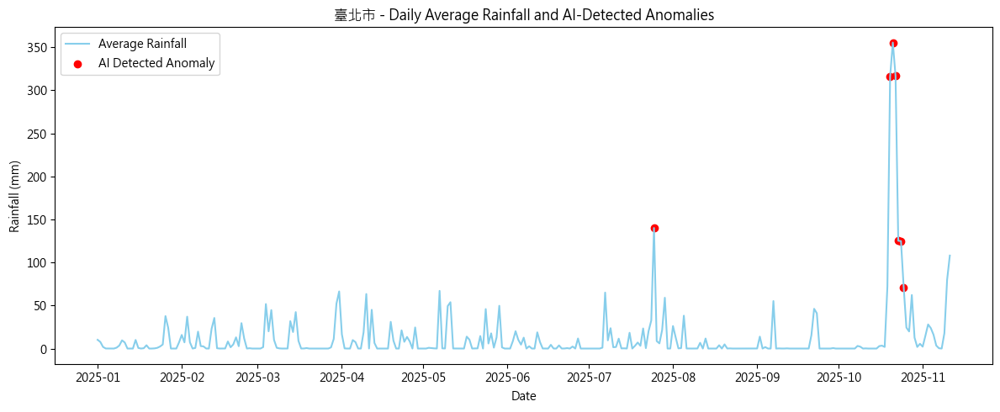

# 🌦️ Taiwan Extreme Weather Anomaly Detection (2025)
### Overview
This project applies unsupervised machine learning (Anomaly Detection) to detect extreme rainfall events in Taiwan using daily precipitation data from the Central Weather Administration (CWA) Open Data Platform.
The analysis identifies rainfall outliers by station and date, highlighting regional and temporal patterns of extreme weather during 2025.

### Objectives
Detect and visualize extreme rainfall anomalies across Taiwan. 
Compare the frequency and timing of anomalies among different regions. 
Demonstrate how AI models (e.g., Z-score, Isolation Forest) can reveal hidden climate patterns.

### Development Environment

This project was developed and tested under the following hardware and software environment:  
| Component | Specification |
|----------|---------------|
| **OS** | Windows 11 |
| **CPU** | Intel Core i5-8400 @ 2.80GHz |
| **RAM** | 16 GB |
| **Python** | 3.10.19 |
| **pandas** | 2.3.3 |
| **numpy** | 2.2.5 |
| **scikit-learn** | 1.7.2 |
| **matplotlib** | 3.10.7 |
| **requests** | 2.32.5 |

> This project does not require GPU acceleration.  
> All data processing steps and anomaly detection models  
> (including Z-score and Isolation Forest) run smoothly on a standard CPU environment.

### Project Structure
```
rain-anomaly-2025/
├─ README.md
├─ DATA_SOURCES.md
├─ data/
│  ├─ rain.csv/          # dataset
├─ src/
│  ├─ json2csv.ipynb      # Converted JSON file from CWA to CSV
│  └─ main.ipynb         # Z-score / IsolationForest anomaly detection
```
### Example Figure — Extreme Rainfall Anomaly Detection

<p align="center">
   <br> <em>Figure 1. Daily rainfall (blue line) and AI-detected anomaly events (red points) in Taipei City during 2025. <br>
Extreme spikes represent unusual precipitation events captured by the model using Isolation Forest + statistical validation.
</em>
</p>

### Conclusion

This project demonstrates how unsupervised machine learning can be applied to 
identify extreme rainfall events across Taiwan. Using the Isolation Forest model, 
we successfully detected abnormal precipitation spikes that typically correspond 
to seasonal heavy rain, monsoon-driven events, or localized extreme weather.

To validate the model, Z-score–based manual anomaly labeling was also performed.  
The comparison shows:  
**AI-detected anomalies align strongly with Z-score manual inspection**, indicating that the model captures meaningful deviations.  
**Northern Taiwan (e.g., Taipei, New Taipei)** exhibits clear extreme rainfall events during late autumn and early winter, consistent with the Northeast Monsoon.  
**Southern and eastern regions (e.g., Pingtung, Taitung)** show more frequent but smaller anomalies, reflecting localized convective rainfall patterns.  

This project also demonstrates the feasibility of converting government open data 
(JSON → CSV), engineering features, and applying AI-driven anomaly detection 
as an end-to-end workflow. Future extensions may integrate reservoir levels, radar 
rainfall, or typhoon path data, or expand into real-time dashboards and early-warning 
systems.

